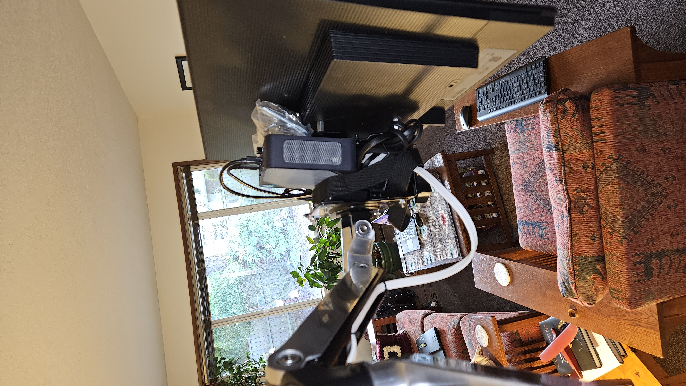
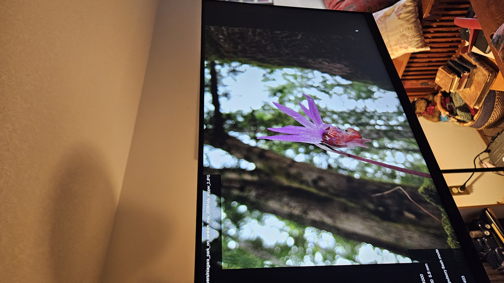

Here are some brief instructions on how to use a small linux box as a digitial photo frame.

# Digital Photo Frame with a Small Linux Box

Any old small linux box (like a Raspberry Pi, BeagleBone, or any other small form factor computer) can be repurposed as a digital photo frame. Below are the steps to set it up.

Some of the steps will be up to you, such as loading your photos onto the device, and connecting it to a display.

## Requirements
- A small linux box (Raspberry Pi, BeagleBone, etc.)
- A display (monitor or TV)
- An SD card or USB drive for storage
- A collection of photos
- Ubuntu 24.4 LTS Desktop, or any other linux distribution using a recent version of Gnome.
- feh (a lightweight image viewer)
- ddcutil (for controlling monitor settings)

## Steps

I will not cover installing the OS here, these instructions you can do that on your own.

Clone this repository to your linux box to get the necessary scripts and configuration files.

From a terminal, run:

```bash
git clone https://github.com/jkstill/slideshow.git
cd slideshow
```

1. **Install utilities**: Open a terminal and run the following command to install feh:

   ```bash
   sudo apt-get update
   sudo apt-get install feh
   sudo apt-get install ddcutil
   ```

2. **Create a User for the Slideshow**: It is a good idea to create a separate user account for running the slideshow. You can do this by running:

The i2c group is needed for ddcutil to work properly.

   ```bash
   sudo adduser slideshow
   usermod -aG i2c slideshow
   ```

3. **Prepare Your Photos**: Copy your collection of photos to a directory on your linux box. For example, you can create a directory called `photos` in your home folder:

   or something like this:

   ```bash
   mkdir ~/slides
   cp /path/to/your/slides/* ~/slides/
   ```

4. **Create a Slideshow Script**: 

   There is already a script provided in this repo this this link [slideshow.sh](./bin/slideshow.sh) you can use it or create your own script to run the slideshow using feh.

5. **Setup the Autostart**: To make the slideshow start automatically when logging in as the `slideshow` user, create a `.desktop` file in the autostart directory:
   
   There is already a file provided in this repo this this link [slideshow.sh.desktop](./config/autostart/slideshow.desktop) you can use it or create your own file with the following content:

   If you use a username other than `slideshow`, make sure to change the `Exec` line accordingly.

6. **Configure feh Settings**: 

    The file `.config/feh/keys` in this repo contains key bindings for feh. You can customize it as needed.

    As is the following key bindings are set to a non-standard value to prevent using ESC or Q to quit the slideshow accidentally.
    - ALT CTL F12 : Quit the slideshow

    The ALT CTL F12 keys are hit sequentially to quit the slideshow.

    You can modify this file or create your own to customize the key bindings.

Simple install:

```bash
tar cvf slideshow.tar .config bin 
scp slideshow.tar slideshow@your-linux-box:~/
ssh slideshow@your-linux-box
tar xvf slideshow.tar
```

It is assumed that photos are found in the `~/slides` directory. You can modify the `slideshow.sh` script to point to a different directory if needed.

Once install, just login as the `slideshow` user, and the slideshow should start automatically.

If you do quit the slideshow with the ALT CTL F12 keys, it will restart automatically after a few seconds.

## My Setup

I am using a [Bosgame N95](https://www.bosgame.com/products/bosgame-mini-pc-n95?_pos=1&_psq=n95&_ss=e&_v=1.0&variant=45690176340131)  4 with Ubuntu 24.4 LTS Desktop installed. 

The display is an inexpensive [Samsung](https://www.samsung.com/us/computing/monitors/smart-monitors/24-s3-s30gd-fhd-ips-100hz-monitor-ls24d300ganxza/) standard computer monitor connected via HDMI.

The setup is mounted on an Ergotron Wall Mount Arm to allow for easy positioning.

The photos are all stored on the internal storage of the Bosgame N95.

Photos of the setup:





